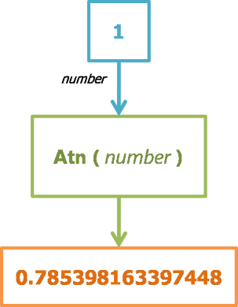

# Atn

Using the Atn Function

In this tutorial you will learn how to use the Atn Function.

> The `Atn` function returns a Double specifying the arctangent of an angle.

> `=Atn(number)`

> *number* any valid number expression that expresses an angle in radians

The Atn function takes the ratio of two sides of a right triangle (number) and returns the corresponding angle in radians. The ratio is the length of the side opposite the angle divided by the length of the side adjacent to the angle.

The range of the result is pi/2 to pi/2 radians.

> [!NOTE]
To convert degrees to radians, multiply degrees by pi/180. To convert radians to degrees, multiply radians by 180/pi.

> [!NOTE]
Atn is the inverse trigonometric function of [Tan](tan.md), which takes an angle as its argument and returns the ratio of two sides of a right triangle. Do not confuse Atn with the cotangent, which is the simple inverse of a tangent (1/tangent).

> Info from MS

- [Office VBA Reference](https://docs.microsoft.com/en-us/office/vba/language/reference/user-interface-help/atn-function)

> [!NOTE]
> Atn(number)
> 
> The required number argument is a Double or any valid numeric expression.

---

Function Engine

In this example we will use 1.



The result is 0.785398163397448.

---

 Query

```sql
SELECT Atn(1);
```

 Form

```vb
=Atn(1)
```

 VBA

```vb
Private Sub Form_Load()
    txtAtn = Atn(1)
End Sub
```

---

## Courses

 [Access Expert 26](https://www.599cd.com/site/courselist/access2013/expert/x26/)

<!-- ## Seminars -->

<!-- ## Tips / Tech Help

See [this](/tips/access/##/) FREE Tip on X and many others -->

<!-- ## Blog

See [this](/blog/display-article.asp?ID=#) Blog Post on X -->

##  Search

You can find more about this by [searching](https://www.599cd.com/search/?Q=atn) the website.
