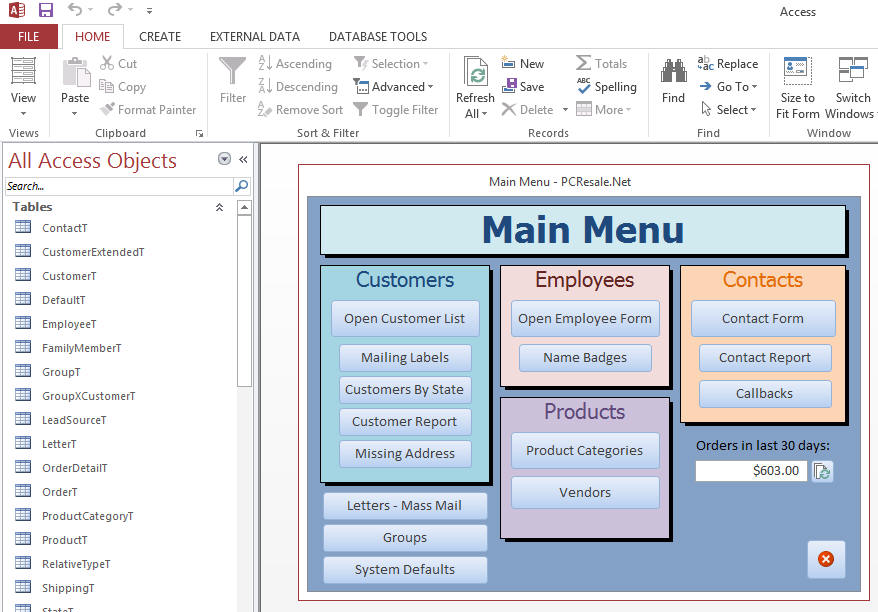
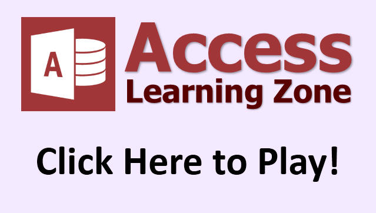

# What is a Microsoft Access Database?

Learn all about databases and Access.

In this tutorial, you will learn what databases are, in general, and what Microsoft Access is, specifically.

This tutorial explains all about Microsoft Access Databases...

<!-- > [!Video embed_link] -->

<!--  -->

<video 
    width="640"
    height="390"
    controls
    poster="../images/click-to-play.jpg"
    src="https://s3.us-east-2.wasabisys.com/599cd/Uploads/2013828ULXLA2EO.MP4">
  <!-- <source src="https://s3.us-east-2.wasabisys.com/599cd/Uploads/2013828ULXLA2EO.MP4" type="video/mp4"> -->
  <!-- <source src=".webm" type="video/webm"> -->
  <!-- 
Your browser doesn't support HTML5 video. Here is a <a href="https://s3.us-east-2.wasabisys.com/599cd/Uploads/2013828ULXLA2EO.MP4">link to the video</a> instead.
 -->
</video>

## Learn More...

Click this link to watch my **FREE** 3-hour long [Access Beginner Level 1 course](https://599cd.com/access/ac13b1free/).
